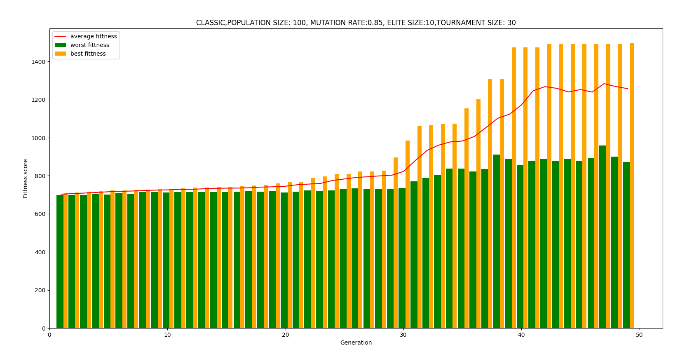
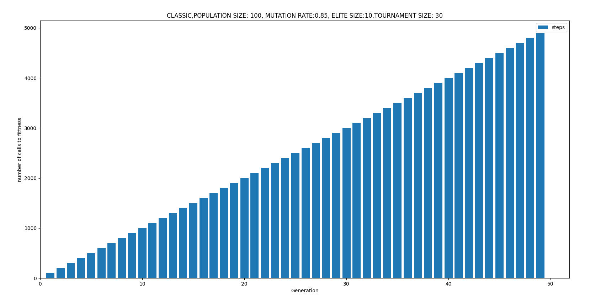
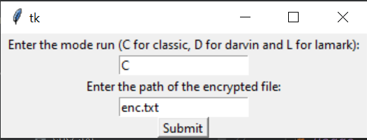
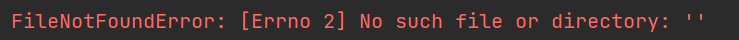
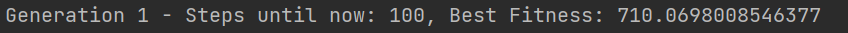

# -ComputationalBiologyEx2
This exercise has been writen by Sigal grabois and Roi Avraham.
# Description
For this assignment we were asked to decipher a mono-alphabetic cipher, this is a cipher built by replacing one letter with another.
The input files received for the purpose of the exercise and required to be in the work folder:
- An enc.txt file containing a text segment containing words encrypted by a mono-alphabetic cipher that must be decoded.
- A file named dict.txt containing a "dictionary" of common English words, a large majority of the words in the text (and of course many other words) are found in it.
- A file called LetterFreq.txt that contains the frequency of the letters of the English alphabet.
- A file called Letter2Freq.txt that contains the frequency of letter pairs (the statistics were calculated from a large database of English texts).

# The output files:
- A file called plain.txt that will contain the encrypted text in decrypted form
- A file named perm.txt that will contain for each character its permutation. 

The algorithm output 2 graphs:

# Installation
In order to run this exercise, you have 2 options:
  1) Double-click on the Genetic_algorithm.exe file (takes 20 seconds more or less till the gui window appears).
  2) You can run the Genetic_algorithm.py file by python Genetic_algorithm.py .
In order to do so you will need to install by pip install the next libraries:
* random
* string
* tkinter
* statistics
* numpy
* matplotlib
 

# Usage
After running the program (by one of the options, as mentioned in Installation section),
the next window will show up:
 

In this window, you will need to enter 2 things:
1) In the first textbox you need to enter the run mode of the algorithm. The run mode can be only <b>one of
the next inputs</b>:
- C 
- D 
- L 
 
If you want to run the algorithm in the classic mode, so you will need to enter C.  
If you want to run the algorithm in the darwin mode, so you will need to enter D.  
If you want to run the algorithm in the lamark mode, so you will need to enter L.  
Please note that if you will not enter one of these input, this error message will show on the console: 
 
"the mode run must be C (for classic) or D (for darwin) or L (for lamark)"
 
and the program will finish.

2) In the second textbox, you will need to enter the path for the encrypted file to be decrypted.
Please note that if you will enter incorrect path, you will show the next error in the console:

- After entering the inputs, click on the submit button and the algorithm will start to run.
  the mode run will be print to the console and after each generation, data about the generation will be print for example:
  
- When the algorithm finishes, you will see the 2 graphs and the files, we mentioned before.

Note that in every generation we print the number of steps until the current generation, so you can see the number of 
all steps the algorithm did in the last generation.

# Dictionary
Genetic_algorithm.py - Document that containing the genetic algorithm for decipher a mono-alphabetic cipher.
Genetic_algorithm.exe - the exe file of Genetic_algorithm.
